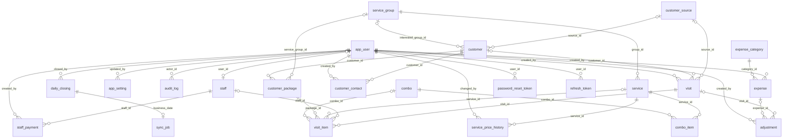
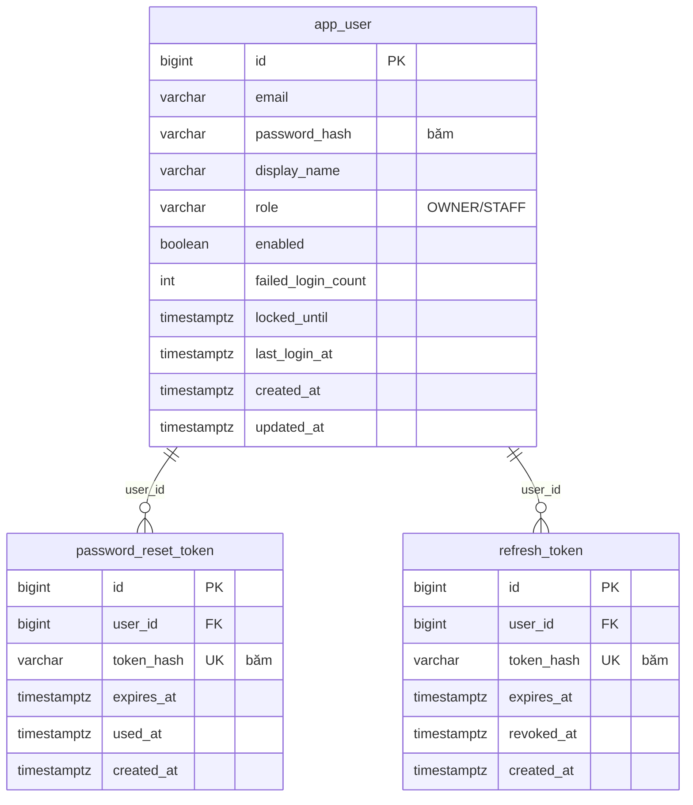
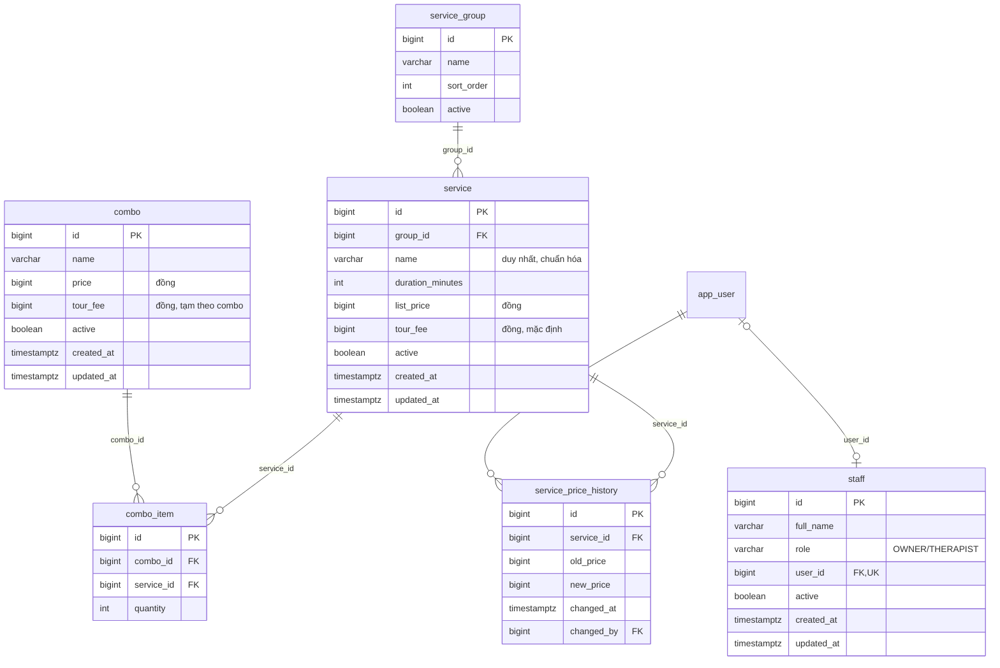
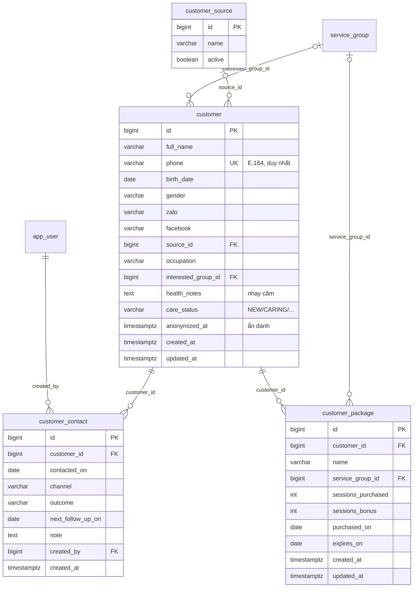
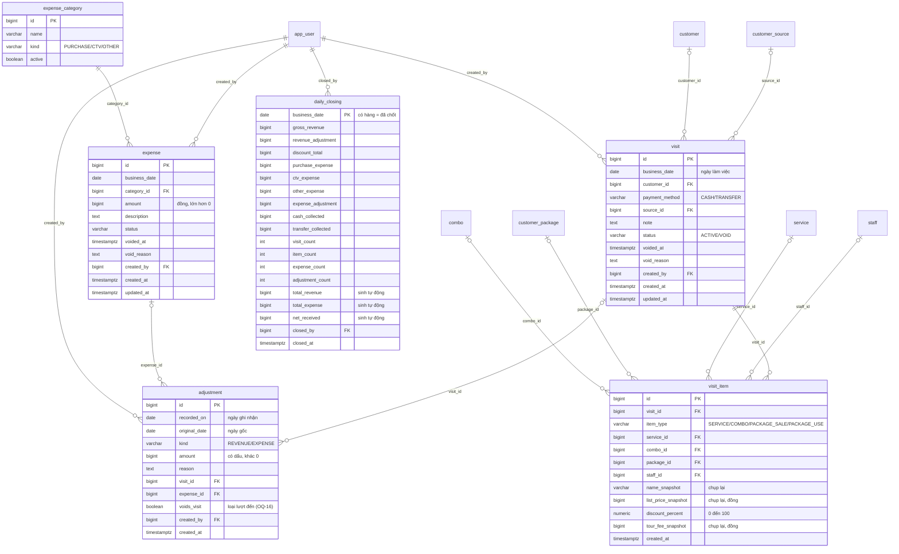
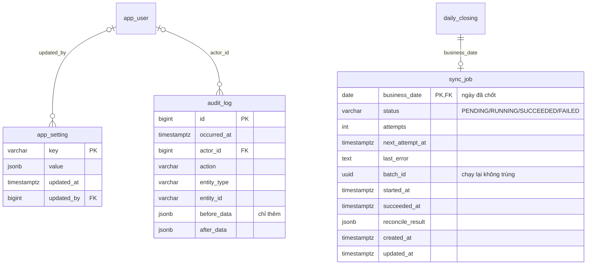
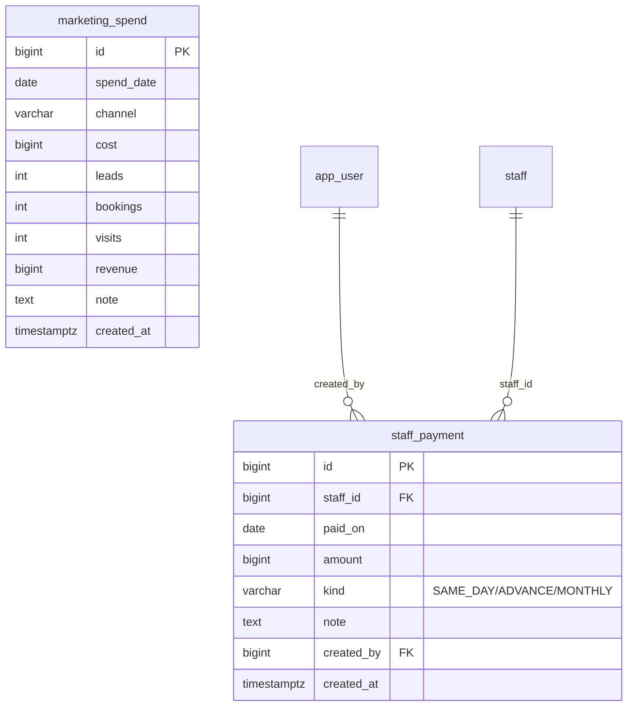

# Thiết kế cơ sở dữ liệu (ERD)

> Phiên bản thiết kế: **v1** (khớp SRS v0.4). Nguồn sự thật là migration Flyway
> [`V1__core_schema.sql`](../../backend/src/main/resources/db/migration/V1__core_schema.sql) và
> [`V2__reference_data.sql`](../../backend/src/main/resources/db/migration/V2__reference_data.sql).
> Các sơ đồ dưới đây **được sinh tự động từ cơ sở dữ liệu thật** bằng
> [`tools/gen_erd_mermaid.py`](tools/gen_erd_mermaid.py), nên không lệch với schema. Sửa schema xong thì chạy lại script.

## 1. Phạm vi

| Đợt | Bảng | Ở đâu |
|---|---|---|
| R1 (MVP) | 19 bảng: xác thực, danh mục, khách, bán hàng, chi phí, chốt sổ, điều chỉnh, nhật ký | `V1`, `V2` (đã có test) |
| R2 | `customer_contact`, `sync_job`, `app_setting` | [`later-releases.sql`](later-releases.sql) (thiết kế, chưa là migration) |
| R3 | `staff_payment`, `marketing_spend`, view `v_staff_tour_accrual`, hàm `staff_balance_as_of()` | như trên |

Flyway chỉ đi tiến nên các bảng R2/R3 chưa tạo sớm; đến sprint tương ứng thì chép thành `V3__`, `V4__`.

## 2. Quy ước

- Khóa chính `BIGINT GENERATED ALWAYS AS IDENTITY`. Riêng `daily_closing` và `sync_job` dùng chính `business_date` làm khóa.
- Tiền là `BIGINT` đồng (BR-01), mọi cột tiền có `CHECK` (không âm, hoặc khác 0 với bút toán).
- Enum dùng `VARCHAR` + `CHECK` với mã tiếng Anh (`ACTIVE`, `VOID`, `CASH`, `TRANSFER`...), tiếng Việt chỉ nằm ở tầng hiển thị. Lý do: thêm giá trị bằng migration đơn giản hơn kiểu `ENUM` của PostgreSQL.
- Ngày làm việc là cột `DATE` (`business_date`) tách khỏi `created_at` (BR-02). Hàm `today_vn()` trả ngày hiện tại theo `Asia/Ho_Chi_Minh`.
- Xóa mềm bằng `status = 'VOID'` kèm `voided_at`, `void_reason` (BR-09). Danh mục dùng cột `active` (BR-19).
- Tên duy nhất không phân biệt hoa thường và dấu cách thừa nhờ chỉ mục trên `norm_name(name)`.
- **Cần cơ sở dữ liệu có locale UTF-8** (ví dụ `C.UTF-8` hoặc `vi_VN.UTF-8`) vì `norm_name` và so sánh chuỗi tiếng Việt.

## 3. Sơ đồ tổng quan

Chỉ vẽ quan hệ, không vẽ cột. Hầu hết đường nối tới `app_user` là cột `created_by`, vì vậy xem từng nhóm bên dưới cho dễ đọc.



## 4. Sơ đồ theo nhóm

### 4.1 Xác thực (FR-AUTH)
`app_user` là tài khoản chủ tiệm. `refresh_token` và `password_reset_token` chỉ lưu **băm** của token, không lưu token thô.



### 4.2 Danh mục: dịch vụ, combo (FR-SVC, FR-CMB)
Giá hiện hành nằm ở `service`; `service_price_history` lưu lịch sử đổi giá để tra cứu. Giao dịch cũ **không** đọc từ đây mà từ bản chụp trong `visit_item` (BR-03).



### 4.3 Khách hàng và gói liệu trình (FR-CUS)
Số lần đến, tổng chi tiêu, ngày cuối đến **không lưu**, được tính trong view `v_customer_stats` (BR-11).



### 4.4 Bán hàng, chi phí, chốt sổ (FR-SAL, FR-EXP, FR-CLS)
Phần lõi của hệ thống.



### 4.5 Hệ thống (R2)


### 4.6 Lương và tour (R3)


Ảnh PNG của từng sơ đồ nằm trong [`diagrams/`](diagrams/) để dùng khi không xem được Mermaid.

## 5. Các quyết định thiết kế chính

### 5.1 Mô hình dòng bán `visit_item`
Một **lượt đến** (`visit`) gồm nhiều **dòng** (`visit_item`). Mỗi dòng thuộc đúng một trong bốn loại, được ép bằng `CHECK ck_vi_shape`:

| `item_type` | Bắt buộc | Giá tính doanh thu |
|---|---|---|
| `SERVICE` | `service_id` | giá niêm yết chụp lại |
| `COMBO` | `combo_id` | giá combo chụp lại |
| `PACKAGE_SALE` | `package_id` (duy nhất một dòng bán cho mỗi gói) | tiền bán gói, tính **đủ** ngày bán (BR-20) |
| `PACKAGE_USE` | `service_id`, `package_id` | **0** và giảm giá 0 |

Mỗi dòng chụp lại `name_snapshot`, `list_price_snapshot`, `tour_fee_snapshot` (BR-03, BR-13).

### 5.2 Giảm giá không lưu thành tiền (BR-04)
Chỉ lưu `list_price_snapshot` và `discount_percent`. Hàm `calc_discount(price, pct) = round(price * pct / 100)` (làm tròn nửa lên, OQ-01) cho ra tiền giảm; view `visit_item_amounts` cung cấp `discount_amount` và `paid_amount` cho mọi truy vấn. Không có cột tiền giảm nên không thể lệch nhau giữa các nơi.

### 5.3 Chốt sổ: sự tồn tại của hàng là trạng thái (BR-06, BR-07)
Không có cột `status` trên ngày. **Ngày đã chốt ⇔ có hàng trong `daily_closing`**; hàng này lưu số liệu đóng băng (doanh thu, chi giảm giá, chi mua hàng, CTV, chi khác, tiền mặt, chuyển khoản, số lượt...). Dịch vụ chốt sổ đọc các số này từ `v_daily_summary` rồi chèn hàng trong cùng transaction. Ba cột `total_revenue`, `total_expense`, `net_received` là cột sinh tự động theo công thức BR-05 nên không thể sai công thức.

Không có thao tác mở lại sổ: bảng bị chặn UPDATE/DELETE (xem 5.5).

### 5.4 Điều chỉnh sau chốt sổ (BR-08, ADR-0003)
`adjustment` là bảng chỉ thêm:
- `recorded_on` là ngày ghi nhận, phải là ngày **chưa chốt**; `original_date` là ngày gốc của khoản bị sửa.
- `kind` là `REVENUE` hoặc `EXPENSE`, `amount` có dấu và khác 0; sai thì ghi bút toán đảo.
- Có thể trỏ tới `visit_id` hoặc `expense_id` để biết điều chỉnh cho khoản nào.
- `voids_visit = true` đánh dấu bút toán **loại bỏ cả lượt đến** đã chốt khỏi thống kê khách (số lần đến, tổng chi tiêu). View `effective_visit` là các lượt đến còn hiệu lực sau khi trừ các lượt bị loại. Đây là đề xuất giải pháp cho **OQ-16**.

### 5.5 Bất biến thực thi ở cơ sở dữ liệu
| Cơ chế | Tác dụng | Mã lỗi |
|---|---|---|
| `lock_business_day(d)` = `pg_advisory_xact_lock(7001, d - 2000-01-01)` | Mỗi ngày một khóa tư vấn trong transaction: chốt sổ và ghi giao dịch cùng ngày được **tuần tự hóa**, tránh chốt trượt một giao dịch đang ghi dở | |
| `trg_visit_day_lock`, `trg_expense_day_lock` | Chặn thêm, sửa, hủy bản ghi mang ngày đã chốt | `XL001` |
| `trg_visit_item_day_lock` | Như trên cho dòng bán (ngày lấy từ lượt đến cha) | `XL001` |
| `trg_adjustment_day_open` | Bút toán phải ghi vào ngày chưa chốt | `XL002` |
| `trg_adjustment_append_only`, `trg_daily_closing_append_only`, `trg_audit_log_append_only` | Cấm UPDATE và DELETE | `XL002` |
| `trg_daily_closing_insert` | Cấm chốt ngày tương lai, và giữ khóa ngày khi chốt | `XL004` |

Backend nên bắt các mã `XL001`, `XL002`, `XL004` và dịch thành lỗi nghiệp vụ có thông báo tiếng Việt.

### 5.6 Doanh thu gói liệu trình (BR-12, BR-20)
`customer_package` lưu số buổi mua, số buổi tặng, hạn dùng. Số buổi đã dùng **tính** bằng số dòng `PACKAGE_USE` hợp lệ, không lưu. Dòng `PACKAGE_SALE` mang đủ tiền gói vào ngày bán; các dòng `PACKAGE_USE` có doanh thu 0 nên không cộng đôi.

## 6. View và công thức dẫn xuất

| View / hàm | Mục đích |
|---|---|
| `visit_item_amounts` | Từng dòng kèm ngày, hình thức thanh toán, trạng thái lượt, giá niêm yết, tiền giảm, tiền khách trả, tour (lọc `visit_status = 'ACTIVE'` khi cần) |
| `effective_visit` | Lượt đến còn hiệu lực (ACTIVE và không bị bút toán loại) |
| `v_daily_summary` | Tổng theo ngày theo BR-05, tính từ dữ liệu gốc, có cờ `is_closed` (dashboard BR-16, xem trước khi chốt) |
| `v_customer_stats` | Số lần đến, tổng chi tiêu (tiền khách thực trả), lần đầu, lần cuối, số ngày chưa quay lại |
| `v_staff_tour_accrual`, `staff_balance_as_of()` (R3) | Tiền tour phát sinh, đã trả, còn nợ |

Công thức (BR-05):

```
Tổng doanh thu = Σ list_price_snapshot (dòng hợp lệ) + Σ điều chỉnh REVENUE
Chi giảm giá   = Σ calc_discount(list_price_snapshot, discount_percent)
Tổng chi       = Chi giảm giá + chi mua hàng + chi CTV + chi khác + Σ điều chỉnh EXPENSE
Thực nhận      = Tổng doanh thu − Tổng chi
```

## 7. Đối soát với Excel tháng 9

`backend/src/test/resources/sql/schema_smoke_test.sql` nạp lại dữ liệu tháng 9/2026 từ file Excel và kiểm tra: **Thực nhận = 448.440 đ**. File Excel hiển thị 315.880 đ vì hai lỗi:

1. Cột THỰC NHẬN trừ tiền giảm **hai lần** (đã nằm trong cột thu sau giảm).
2. Ô G46 có số `69.000` gõ cứng chen vào công thức.

Hệ thống mới tính theo công thức ở mục 6 nên không mắc hai lỗi này.

## 8. Truy vết yêu cầu → bảng

| Nhóm FR | Bảng / đối tượng chính |
|---|---|
| FR-AUTH | `app_user`, `refresh_token`, `password_reset_token` |
| FR-SVC | `service_group`, `service`, `service_price_history` |
| FR-CMB | `combo`, `combo_item` |
| FR-SAL | `visit`, `visit_item`, `staff`, `customer_source` |
| FR-EXP | `expense`, `expense_category` |
| FR-CLS | `daily_closing`, `adjustment`, các trigger mục 5.5 |
| FR-CUS | `customer`, `customer_package`, `v_customer_stats`; R2: `customer_contact` |
| FR-DSH | `v_daily_summary` và các truy vấn tổng hợp |
| FR-SYN | R2: `sync_job` |
| FR-SYS, FR-AUD | `app_setting` (R2), `audit_log` |
| FR-PAY | R3: `staff_payment`, `v_staff_tour_accrual` |
| FR-ADS | R3: `marketing_spend` |

## 9. Điều DB không thực thi, tầng dịch vụ phải làm

- **Dòng `PACKAGE_USE` phải có khách** (`visit.customer_id` không rỗng): kiểm tra ở service.
- **Không dùng quá số buổi của gói**: kiểm tra ở service, khóa hàng `customer_package` (`SELECT ... FOR UPDATE`) khi ghi dòng `PACKAGE_USE`.
- Chuẩn hóa số điện thoại về E.164 (`+84...`) trước khi lưu; DB chỉ kiểm tra khuôn dạng (BR-10).
- Ghi `audit_log` (BR-18) và, ở R2, thêm hàng `sync_job` `PENDING` **cùng transaction** với việc chốt sổ.
- Hạn mức hiển thị, phân nhóm khách VIP/thân thiết (BR-17) tính ở truy vấn hoặc service, không có cột.

## 10. Điểm còn mở

| Mã | Nội dung | Ảnh hưởng tới schema |
|---|---|---|
| OQ-06 | Tiền tour của combo và liệu trình tính thế nào | Hiện `tour_fee_snapshot` nằm trên từng dòng nên đủ cho cả hai cách; chưa cần đổi |
| OQ-07 | Một lượt đến trả bằng nhiều hình thức (vừa TM vừa CK) | Hiện `payment_method` nằm trên `visit` (một hình thức). Nếu cần tách, thêm bảng `visit_payment` ở bản sau |
| OQ-08 | Khách không có số điện thoại | `visit.customer_id` cho phép rỗng (khách vãng lai không có hồ sơ). `customer.phone` bắt buộc (chuẩn E.164, duy nhất) trừ hồ sơ đã ẩn danh (`anonymized_at`) |
| OQ-16 | Hủy lượt đã chốt ảnh hưởng thống kê khách | Đề xuất: `adjustment.voids_visit` + `effective_visit` (mục 5.4) |
| OQ-17 (mới) | Tiền tour trả nhân viên có tính vào **Tổng chi** của ngày không | Chủ tiệm quyết định; nếu có, thêm loại chi phí hoặc cột vào `daily_closing` ở R3 |

## 11. Chạy lại và kiểm thử

```bash
# Tạo CSDL (UTF-8), nạp schema và dữ liệu danh mục
createdb -E UTF8 --locale=C.UTF-8 -T template0 xile_test
psql -d xile_test -v ON_ERROR_STOP=1 -f backend/src/main/resources/db/migration/V1__core_schema.sql
psql -d xile_test -v ON_ERROR_STOP=1 -f backend/src/main/resources/db/migration/V2__reference_data.sql

# Bộ kiểm thử (chạy trong transaction rồi ROLLBACK, không để lại dữ liệu)
psql -d xile_test -v ON_ERROR_STOP=1 -f backend/src/test/resources/sql/schema_smoke_test.sql

# Sinh lại sơ đồ
cd docs/design/tools
PSQL_CMD='psql -d xile_test' python3 gen_erd_mermaid.py ../diagrams
```

Khi dựng backend, bộ kiểm thử này sẽ được chuyển sang Testcontainers (PostgreSQL 16) trong CI.
